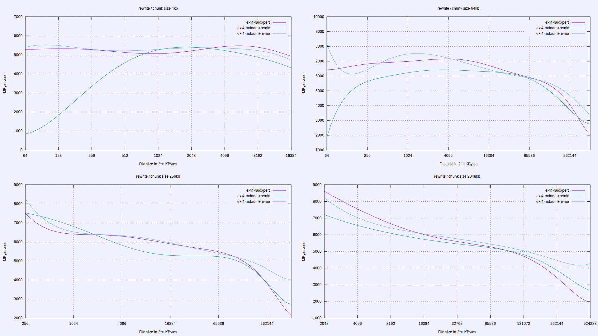

## Contents

This folder contains performance data for your review and comparison.

All configurations below encompass RAID0 array with 4 NVMe gen 4 devices.

- `ext4-mdadm+nvme` - ext4-formatted `mdadm` array and `nvme` driver;
- `ext4-mdadm+rcraid` - ext4-formatted `mdadm` array and `rcraid` driver;
- `ext4-raidxpert` - ext4-formatted `RAIDXpert` array (`rcraid` implied);
- `ntfs-raidxpert` - ntfs-formatted `RAIDXpert` array (`rcraid` implied).

NTFS data is excluded from charts because the filesystem performance is
radically different than that of the ext4.

## Viewing

These are 3D graphs. To view them, install `gnuplot` and run:

```
./split_data
gnuplot gnu3d.plot
gnuplot gnu2d.plot
```

Graph titles and legend should contain all the relevant details.





